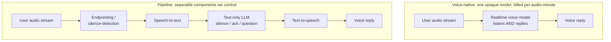

# shutupandlisten — Delivery Cost & Quality Evaluation

## Summary

Evaluate how to deliver shutupandlisten to other people at a quality at least
equal to the operator's current "ChatGPT/Claude voice + the instructions"
experience, and at a cost structure that allows driving adoption before
monetizing. The evaluation runs two coupled axes — delivered experience
quality (can a transcript → text-LLM pipeline, cloud first and on-device later,
hold restraint and naturalness against the cloud-voice baseline) and unit
economics (per-session and per-user cost of cloud-voice vs cloud-pipeline vs
on-device delivery) — and recommends a delivery architecture where acceptable
quality meets sustainable cost.

---

## Problem Frame

Today shutupandlisten is a system prompt the operator pastes into a personal,
paid ChatGPT or Claude voice session. It works well enough that the operator
uses it daily: the model stays quiet, and follow-up quality is acceptable. The
premise is already validated. What is unproven is *delivery to others*.

The only way someone else gets the experience now is to build their own custom
GPT or Claude project and pay for their own voice usage. That does not scale to
adoption.

The blocker on a hosted version is cost, and the product's usage shape makes it
acute. Sessions are long and mostly-listening — a person thinks out loud for
many minutes while the system stays silent. That is the worst case for
realtime-voice billing, which charges per minute of audio regardless of how
little the system says. At adoption scale, a free hosted product on cloud voice
bleeds money and forces monetization before adoption has built. The cost of an
"off-host" version — one whose marginal cost the operator does not pay — is the
number this evaluation has to put on the table.

---

## Key Decisions

- Economics drive the architecture, not privacy. Broad, low-friction adoption
  cannot coexist with per-minute cloud cost, so on-device delivery (~$0 marginal
  cost) is the economic endgame. Privacy of raw thought rides along for free
  with on-device but is not the gate that forces the decision — cost is. The
  on-device quality gap is therefore a risk to confront in this evaluation, not
  a concern to defer.

- The operator's ChatGPT voice + instructions setup is the fixed quality
  baseline. It already works, so the evaluation measures every candidate against
  it rather than re-asking whether a quiet companion is viable. Follow-up and
  restraint quality is measured with the existing `promptfoo` judges; voice-feel
  (timing, naturalness, "aliveness") is measured qualitatively, because the
  judges score text and are blind to it.

- Pipeline over voice-native, on both control and cost. A pipeline —
  endpointing/silence-detection the product controls → speech-to-text → a
  text-only LLM that decides the reply → text-to-speech — keeps silence
  tunable and makes the reply decision directly scoreable by the existing
  judges. For this workload it is also far cheaper on cloud (cheap per-minute
  ASR + small text-token counts + minimal TTS) than realtime voice-native audio
  billing, and it is the only architecture that can move off-host onto the
  user's device. Voice-native is both pricier for long mostly-listening sessions
  and a dead-end for on-device.

- Validate against the baseline before committing v1. Build only enough of the
  pipeline to A/B it against the live cloud-voice baseline. If it matches
  naturalness and beats today's "ok" follow-ups, the pipeline is v1; if it
  cannot hold the "alive" feel, productizing cloud voice-native becomes the
  honest v1 and the cost model decides how soon monetization must follow.

The two architectures the evaluation weighs:

---

## Requirements

**Quality validation**

- R1. Document the operator's ChatGPT voice + instructions setup as the fixed
  baseline every candidate is measured against.
- R2. Score pipeline follow-up and restraint quality with the existing
  `promptfoo` judges (restraint, variety, probing-depth) against that baseline.
- R3. Assess voice-feel — turn-timing, latency, naturalness — qualitatively,
  since the judges are blind to it; this is the dimension most at risk in a
  pipeline.
- R4. Report where the best cloud pipeline and the best on-device configuration
  each land against the baseline on both dimensions.

**Cost model**

- R5. Produce per-session and per-user-month cost figures for three delivery
  options: cloud voice-native, cloud pipeline, and on-device.
- R6. Base every figure on verified current pricing (Anthropic via the
  `claude-api` reference; OpenAI, ASR, and TTS from their live pricing), not
  estimates from memory.
- R7. Model cost against the real usage shape — long, mostly-listening sessions
  — with session-length and frequency assumptions stated explicitly.
- R8. State each option's adoption-vs-monetization implication: whether it can
  be given away to drive adoption or forces paid tiers, and the scale at which
  its economics break.

**Architecture & models**

- R9. Frame the evaluation on the pipeline architecture; cover voice-native as a
  baseline reference, not a deep benchmark.
- R10. Identify candidate model classes for each pipeline stage (endpointing/VAD,
  speech-to-text, text-LLM, text-to-speech) for web delivery, concentrating
  effort on endpointing (a thinking-pause vs a finished thought) and end-to-end
  latency, and treating ASR and TTS as commodity picks.
- R11. Evaluate the text-LLM in both a full-brain role and a reduced role where
  the endpointing+rules layer handles silence/acknowledgments and the model is
  invoked only for substantive replies — lowering the bar a small, eventually
  on-device, model must clear.

**Deliverable**

- R12. Deliver a decision-ready recommendation: the v1 delivery architecture,
  the quality gap (if any) versus the baseline, the cost per user, and the
  resulting monetization posture.

---

## Success Criteria

- The recommendation is decision-ready: the operator can choose a v1 delivery
  architecture and a monetization posture from it without further research.
- The cost model uses verified pricing and states its usage assumptions, so it
  can be re-run as pricing or usage assumptions change.
- The quality verdict separates the two dimensions — follow-up quality (judges)
  and naturalness (qualitative) — and says plainly whether the pipeline
  matches/beats the baseline and how far on-device trails cloud.
- The evaluation names the honest fallback if on-device cannot reach acceptable
  quality (cloud pipeline + earlier monetization) rather than leaving it
  implicit.

---

## Scope Boundaries

**Deferred for later**

- iOS / native delivery — acknowledged as at-least-as-good as web and the
  stronger privacy-provable platform, but gated on intermittent Mac access;
  revisit once web validates.
- On-device *build* work — this evaluation models on-device cost and quality and
  may prototype to measure, but does not ship an on-device app.
- Privacy/local-only as a primary requirement — it follows from on-device but is
  not the driver; cost is.

**Outside this evaluation**

- Building the shippable product (web app, voice UX, visual design — design is
  handled separately). The deliverable is the evaluation and recommendation,
  plus only the measurement prototype needed to produce it.

---

## Dependencies / Assumptions

- The existing `promptfoo` harness (simulator + restraint/variety/probing judges)
  is reusable to score the pipeline's text-LLM stage by pointing it at a pipeline
  transcript; it does not cover the audio layer.
- The operator's live cloud-voice baseline is accessible for side-by-side
  comparison (it is the operator's daily setup).
- Verified pricing is obtainable for all priced components (cloud LLM, realtime
  voice, ASR, TTS).
- On-device delivery assumes a device-capability floor; the size of the
  addressable audience that clears it is itself an output of the
  cost/feasibility analysis, not a given.

---

## Outstanding Questions

All planning-blocking questions are resolved: the baseline reference is fixed to
ChatGPT voice + instructions (R1).

**Deferred to planning**

- Pipeline acceptance threshold — the pass test is "would the operator reach for
  the pipeline over their ChatGPT voice setup?", calibrated against real pipeline
  output during the eval, since naturalness cannot be judged in the abstract.
- Session-length and sessions/user/day assumptions for the cost model (a range
  with sensitivity analysis is fine).
- The device-capability floor to target for the on-device tier (which devices
  must be able to run the stack).
