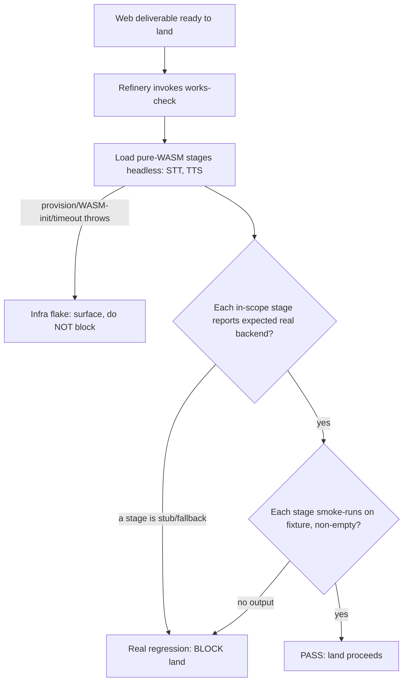

# Rig-wide testing & quality strategy — requirements

## Summary

Establish a standing rule for the shutupandlisten rig: no operator-facing web
deliverable lands until an automated works-check proves the stages that *can*
run on the gate host actually run on their real backends. The gate host is a
GPU-less, audio-less VM, so the check is scoped to the **pure-WASM stages** —
STT and TTS — which load headless via onnxruntime-web with no GPU and no audio
device. It asserts each reports its real WASM backend (no stub) and smoke-runs
it once on a fixture. `su-lou.8`'s TTS stub — also PR #20's stage, the
highest-value catch and the one that IS reachable headless — is its first
catch, fixed alongside the guard. The WebGPU stage (listener) and the
AudioWorklet stages (denoise, VAD/smart-turn) are out of headless reach on this
host and are named as a deferred, operator-side tier.

## Problem Frame

The operator is the integration test. At `1d36c86` the `web/` `node --test`
suite (18 files) was green while the warmed loop degraded three of five stages
to their fallback in a real browser — denoise to passthrough, smart-turn to
heuristic, TTS to stub (`su-lou.8`). The unit tests exercise config and
fallback *logic* on stubs; none load a real provisioned stage, so nothing but
the operator caught the degradation. The earlier TTS defect (`su-lou.7`,
PR #20) was likewise caught by review, not tests.

The rig already runs two quality regimes: promptfoo evals for listener
*behavior*, and the `node --test` suite for browser-pipeline *logic*. Neither
loads a real stage backend. That gap is where regressions reach the operator
silently, and each one costs a manual browser session to find.

## What the gate host can and cannot run (verified)

A feasibility pass (`su-lpdj.1`, verified 2026-07-17) established what is
reachable on the gate host, and it reshaped this strategy:

- **No GPU.** The host is a paravirtualized VM (`/sys/class/drm/card1`:
  virtio-pci `1AF4:1050`); Chromium WebGPU on Linux needs Vulkan, which is
  absent. The **listener (WebGPU)** cannot load headless here. Software Vulkan
  (lavapipe) was considered and rejected — a multi-GB LLM on a software
  rasterizer is far too slow for a pre-land gate.
- **No real browser on the host.** The rig host *serves* the app (vite dev,
  bound to `127.0.0.1`, exposed to the operator's Tailscale host); the
  **operator's machine** runs the browser and its WebGPU. Only
  `chromium_headless_shell` is cached, which has no WebGPU.
- **No audio device.** The **AudioWorklet** stages cannot run headless:
  denoise is an AudioWorklet, and VAD/smart-turn is `@ricky0123/vad-web`
  (AudioWorklet + a runtime CDN fetch). `src/denoise.ts:25` already concedes
  the node test env "cannot exercise an AudioWorklet."
- **Reachable: the pure-WASM stages.** STT (Moonshine, onnxruntime-web `wasm`)
  and TTS (`mms-tts-eng`, `device:'wasm'`, `dtype:'q8'`) load and run headless
  with no GPU and no audio device. TTS is `su-lou.8`'s actual bug and PR #20's
  stage — the highest-value assert is also the one that is reachable.

## Key Decisions

- **Vertical slice first.** Design the works-gate as a concept and ship the
  pure-WASM real-backend check as its first concrete unit; keep the multi-tier
  framework thin and let it harden as more units land. Fastest to value, least
  speculative structure, and it fits the attention-budget rule — remove QA
  load, don't add review surface.
- **The gate runs headless on the rig host, scoped to the pure-WASM stages.**
  The refinery runs the check before it lands a web deliverable, over STT and
  TTS via onnxruntime-web WASM in the cached headless shell. It costs zero
  GitHub-Actions minutes and its failures are inspectable directly. It does
  **not** attempt the WebGPU or AudioWorklet stages — those are not reachable
  on this host (see above).
- **The bar is "the reachable stage ran on its real backend," not "the output
  is good."** The check asserts each pure-WASM stage loads its real WASM
  backend and smoke-runs once on a fixture; it does not score output. promptfoo
  already owns quality (restraint / variety / probing-depth), and overlap would
  duplicate that regime and add flake.
- **Block real regressions; pass through infra flakes.** A stage that loaded
  but reports a stub/fallback backend, or produced nothing on its fixture,
  fails the land; a provisioning, WASM-init, or timeout failure surfaces loudly
  but does not wedge the land.
- **Separate the check from its enforcement.** The works-check is a
  host-agnostic repeatable command; refinery invocation is the enforcement
  layer. The command can ship and be iterated before the enforcement wiring is
  finalized.
- **The unreachable stages are a named deferred tier, not a silent gap.** The
  WebGPU stage (listener) and the AudioWorklet stages (denoise, VAD/smart-turn)
  get their works-check on an operator-side or GPU/audio-capable host later.
  The strategy names this tier so the coverage boundary is explicit.

## Requirements

**The works-check**

- R1 *(reshaped)*. The works-check loads the **pure-WASM pipeline stages (STT,
  TTS)** headless in the cached headless shell against a production-shaped
  build — not the whole pipeline, which the gate host cannot run.
- R2. For each in-scope stage, the check asserts the stage reports its expected
  real backend — not a stub or fallback. (For STT and TTS the expected backend
  is `wasm`.)
- R3. Each stage's expected backend is declared explicitly, so a stage whose
  intended floor is a fallback is not counted as a regression.
- R4 *(reshaped)*. After the load-assert, the check **smoke-runs each in-scope
  stage once on a fixture** — STT on a fixture WAV → non-empty transcript, TTS
  on fixture text → non-empty audio — proving the stage runs, not merely loads.
  (Full-loop end-to-end liveness is out of headless reach and moves to the
  deferred operator-side tier.)
- R5. The check classifies each failure as a real regression (a stage loaded
  but reports a stub/fallback backend; or its smoke-run produced nothing) or an
  infra flake (provisioning, WASM init, or a stage load threw or timed out).
- R6. The check is a single repeatable command, runnable independently of the
  refinery.

**Enforcement (the gate)**

- R7. The refinery runs the works-check before it lands a web deliverable.
- R8. A real-regression verdict blocks the land and names the failing stage.
- R9. An infra-flake verdict does not block the land; it surfaces the failure
  prominently for investigation.
- R10. The gate runs on the rig host, reusing the already-provisioned WASM
  assets, and consumes no GitHub-Actions minutes.

**The standing strategy**

- R11. The strategy states the principle that every operator-facing deliverable
  has an automated works-check *for the stages a gate host can run*, and names
  the rig's testing tiers: unit logic (`node --test`), prompt-quality
  (promptfoo evals), and the real-backend works-gate (pure-WASM stages now;
  WebGPU + AudioWorklet stages deferred).
- R12. The strategy records the works-gate's home (refinery, headless-on-host)
  and its deferred tier: the WebGPU stage (listener) and AudioWorklet stages
  (denoise, VAD/smart-turn) get a works-check on an operator-side or
  GPU/audio-capable host later; GitHub Actions remains a further tier for cheap
  or occasional checks, minutes permitting.

**First validated unit (`su-lou.8`)**

- R13. `su-lou.8`'s three degradations are diagnosed — denoise passthrough,
  smart-turn heuristic, TTS stub.
- R14 *(scoped)*. The **TTS stub** (the reachable degradation, and PR #20's
  stage) is fixed and its pure-WASM works-check guard lands with it, so that
  regression cannot silently reach the operator again. The denoise and
  smart-turn degradations are fixed as bugs, but their guard is the deferred
  operator-side tier (R12), not this headless slice — noted so the coverage
  boundary is not mistaken for full su-lou.8 coverage.

## Key Flows

F1. Pre-land works-gate
- **Trigger:** A web deliverable is ready to land and the refinery is about to
  merge it.
- **Steps:** Refinery invokes the works-check → check loads the pure-WASM
  stages headless → asserts each reports its expected real WASM backend →
  smoke-runs each once on a fixture for non-empty output → returns a verdict.
- **Outcome:** Pass → land proceeds. Real regression → land blocked, failing
  stage named. Infra flake → land proceeds, failure surfaced.
- **Covered by:** R1, R2, R4, R5, R7, R8, R9

## Acceptance Examples

- AE1. **Covers R2, R8.** **Given** TTS is provisioned but loads as its stub
  tone, **when** the works-check runs, **then** it returns a real regression
  and blocks the land, naming TTS.
- AE2. **Covers R5, R9.** **Given** the headless shell fails to launch or a
  WASM stage load times out, **when** the works-check runs, **then** it returns
  an infra flake, the land proceeds, and the failure is surfaced for
  investigation.
- AE3. **Covers R3.** **Given** a stage's intended floor is a declared
  fallback, **when** the works-check runs and the stage reports that fallback,
  **then** it is not counted as a regression.
- AE4 *(reshaped)*. **Covers R4.** **Given** STT loads its real WASM backend
  but returns an empty transcript on the fixture WAV, **when** the works-check
  runs, **then** it returns a real regression for the liveness failure, not a
  pass.

## Success Criteria

- The `su-lou.8` TTS-stub regression class — a provisioned pure-WASM stage
  silently serving its stub — cannot reach the operator without failing the
  gate first.
- The gate is the first runner of the reachable stages, not the operator.
- The gate adds no human review step: its verdict is automatic (block or pass),
  consistent with the attention-budget rule.
- The coverage boundary is explicit: the WebGPU and AudioWorklet stages are a
  named deferred tier, never a silent gap.

## Scope Boundaries

Deferred for later (named tiers, not silent gaps):
- The **WebGPU stage** (listener) and **AudioWorklet stages** (denoise,
  VAD/smart-turn) works-check — needs an operator-side or GPU/audio-capable
  host; this host cannot run them.
- Full-loop end-to-end liveness across all five stages — belongs to the same
  operator-side tier, where the real browser + WebGPU + audio exist.
- Cloud or self-hosted GitHub-Actions CI for heavy paths — the private repo's
  Action-minute budget makes it a later tier.
- Putting the `node --test` unit suite behind the same refinery gate — an easy
  adjacent win, but not part of the first slice.

Outside this strategy's identity:
- Output-quality judgment — promptfoo owns restraint / variety / probing-depth;
  the works-gate never scores quality.
- The on-device / AS-native endgame beyond the browser floor — that is the
  `su-lou` epic's scope, not this strategy's.

## Dependencies / Assumptions

- The gate host has the **pure-WASM** stage assets provisioned (STT + TTS under
  `web/public/`) and the `chromium_headless_shell` is cached. It does **not**
  have a GPU, a real browser, or an audio device — verified, not assumed.
- STT and TTS run under onnxruntime-web `wasm` with no GPU and no audio device
  (STT consumes a decoded PCM buffer, not a live mic; TTS emits audio samples).
  Whether the fixture smoke-run (R4), as opposed to load-assert only (R2), is
  reachable headless is a light planning spike — very likely, confirm before
  building.

## Outstanding Questions

Remaining items are answerable by codebase exploration or a quick spike, and
planning sequences them first; the strategy's shape does not depend on their
answers.

- Whether the rig refinery already exposes a per-rig pre-land hook the
  works-check can attach to, or one must be added. Explore gc-toolkit's refinery
  first; if a hook must be built, that is a shared-infra change to raise with
  the operator before proceeding (the restraint-on-shared-infra rule applies).
- Whether smart-turn's heuristic is the intended floor or it should reach an
  on-device backend (`su-lou.3` has context; no smart-turn provisioner exists
  today, and VAD assets are CDN-fetched at runtime). Resolves R3's
  expected-backend declaration for that stage; rides with the `su-lou.8` fix and
  belongs to the deferred AudioWorklet tier.
- The exact signal taxonomy that separates a real regression from an infra
  flake (R5) — which specific WASM-load / smoke-run outcomes map to which
  verdict.

Resolved by the `su-lpdj.1` feasibility pass (no longer open):
- Whether headless Chromium can load the WebGPU listener on the gate host — **no**
  (no Vulkan; virtio-gpu VM). Reshaped R1 out of full-pipeline scope.
- Whether the AudioWorklet stages can run headless — **no** (no audio device).
  Moved denoise + VAD/smart-turn to the deferred tier.

## Sources / Research

- `su-lpdj.1` (bead note, verified 2026-07-17) — the feasibility pass that
  reshaped this doc: no GPU (virtio-gpu VM), no real browser on host (serves via
  vite to the operator's machine), no audio device (AudioWorklet stages), only
  `chromium_headless_shell` cached; salvageable core = pure-WASM STT + TTS.
- `su-lou.8` (bead) — the motivating regression: provisioned stages degrade to
  fallback in a real browser while unit tests stay green.
- PR #20 / `su-lou.7` — prior TTS stub defect caught by review, not tests.
- `web/src/stt.ts`, `web/src/stt.worker.ts` — STT on CPU/WASM (`device:'wasm'`).
- `web/src/denoise.ts` (`:25` AudioWorklet concession), `web/src/vad.ts`,
  `web/src/smart-turn.ts` — the AudioWorklet / VAD stages, not headless-reachable.
- `web/src/listener.worker.ts` — listener WebGPU-first (`device:'webgpu'`), WASM
  fallback; the WebGPU path needs a GPU the gate host lacks.
- `.github/workflows/promptfoo.yml` — the existing cost-gated prompt-quality
  CI; the precedent for gating heavy paid jobs off per-push runs.
- `CONCEPTS.md` — pipeline stages and roles (endpointing → STT → listener →
  TTS; listener / thinker / judges).
