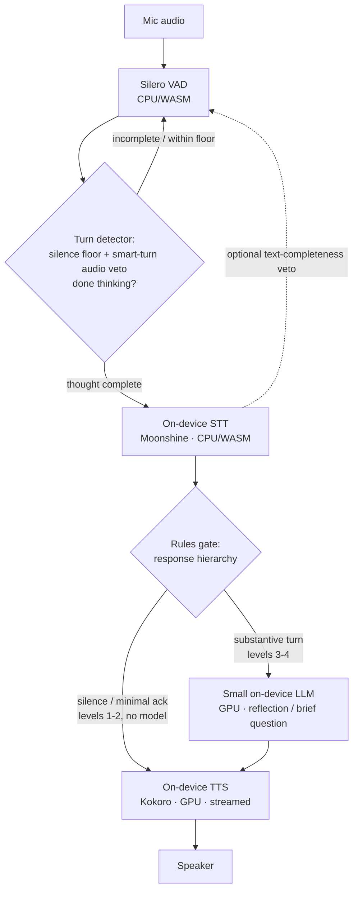
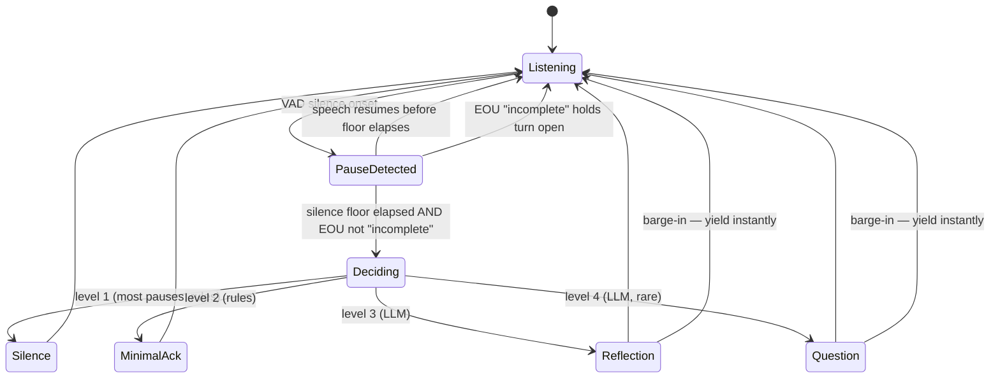

# feat: On-device quiet-companion validation (browser floor → Apple-Silicon-native iOS precursor)

## Summary

Build an on-device voice pipeline (turn-detection → speech-to-text → small LLM → text-to-speech) and validate that the quiet-companion flow is useful enough to reach for — first as a fully in-browser build (the easy-to-test performance floor), then as an Apple-Silicon-native build (the iOS-migration precursor). The existing `promptfoo` judges score the text-LLM stage independent of runtime, so quality is measured once across both runtimes. The deliverable is a decision-ready recommendation: is the on-device flow worth pursuing as v1, what are its flaws, and how far does the browser floor sit below the native ceiling.

---

## Problem Frame

The product premise is already validated — the operator uses the quiet thought companion daily as a pasted system prompt on a paid voice session. What is unproven is *on-device delivery*: whether a stack small enough to run on the user's own device, at ~$0 marginal cost, holds enough restraint and naturalness to be useful.

This plan deliberately drops the original "match or beat the ChatGPT-voice baseline" framing. The operator does not want a comparison against their daily setup; the question is the simpler, lower bar — **is the on-device flow useful to them, flaws and all?** "If we can land anything on-device, that's a net-useful framework." So the baseline demotes from a scored A/B to, at most, a loose qualitative reference for what *useful* feels like.

The cost model (origin R5–R8) stays deferred. On-device is built and measured for *quality and usefulness* now; its per-user economics are a later phase.

---

## Requirements

Origin R-IDs are preserved for traceability; each is reframed away from the baseline A/B toward on-device usefulness. Origin R5–R8 (cost model) are out of scope — see Scope Boundaries.

**Quality validation**

- R1. Define a lightweight usefulness bar — what makes the quiet-companion flow worth reaching for — drawn from the operator's daily use, as a qualitative rubric rather than a scored comparison against the ChatGPT-voice baseline.
- R2. Score the on-device text-LLM stage's follow-up and restraint quality with the existing `promptfoo` judges (restraint, variety, probing-depth) as an absolute characterization across candidate model sizes — no baseline delta.
- R3. Assess voice-feel — turn-timing, latency, "aliveness", and above all whether the companion waits through a thinking-pause instead of treating it as a turn — qualitatively, by the operator using a warmed live loop (cold-load tax excluded from the judgment).
- R4. Report where the best browser-on-device configuration and the best Apple-Silicon-native configuration each land on both dimensions (judge scores and operator usefulness), measured against the R1 usefulness bar, with browser runtime-tax separated from model capability so a browser result is not misread as the product's ceiling.

**Architecture & models**

- R9. Frame the evaluation on the on-device pipeline architecture; note voice-native only as a reference point, not a benchmark.
- R10. Identify candidate on-device model classes for each pipeline stage (turn-detection/VAD, STT, text-LLM, TTS), each with both a browser (WebGPU/WASM) and a Core ML/MLX build, concentrating effort on patience-tuned turn-detection and treating STT and TTS as commodity picks.
- R11. Evaluate the text-LLM in both a full-brain role and a reduced role where the endpointing+rules layer handles silence and acknowledgments and the model is invoked only for substantive replies — lowering the bar a small on-device model must clear.

**Deliverable**

- R12. Deliver a decision-ready recommendation: whether the on-device flow is useful enough to pursue as the v1 framework, its flaws, the browser-floor-to-native-ceiling gap, and the iOS-migration path.

---

## Key Technical Decisions

- **On-device only; no cloud in the live loop.** Cloud components existed only to serve the dropped baseline A/B. Every live-loop stage runs on-device. A single cloud "ceiling" LLM may be added to the *judge runs* as a reference for how far a tiny model trails — default off, and confined to the harness (see the synthetic-vs-real boundary below); it is never wired into the U3–U6 loop.

- **Turn detection is the product-defining component, tuned toward patience — and the patience window is the primary signal.** Standard voice agents minimize latency; this product inverts that — bias to silence, never mistake a thinking-pause for a finished thought. The error cost is asymmetric: a false cutoff (interrupting a thinker) is the cardinal sin, a false continuation (staying silent when a reply was invited) is benign and on-brand. So the load-bearing tunable is a **high min-silence floor (the patience window, on the order of seconds)**, raised well past the sub-second defaults voice agents use for users "gathering their thoughts."

- **The EOU model is smart-turn v3, used asymmetrically — it may only extend the floor, never short-circuit it.** Default the end-of-utterance check to Pipecat `smart-turn v3` (an ~8M-param audio classifier, ~8 MB int8, ~12 ms on CPU — it runs on CPU/WASM, off the scarce GPU budget). Avoid LiveKit's text turn-detector (deprecated, slated for removal). Off-the-shelf EOU answers "is this utterance *complete*?", not "is this person *done thinking*?" — a thinker finishes a sentence then pauses — so use it asymmetrically: an "incomplete" signal *extends* the patience window; a "complete" signal is ignored until the silence floor elapses. Patience window and EOU are therefore one coupled tradeoff (a reliable EOU lets the floor shorten without cutting people off), not two independent layers.

- **Runtime placement: CPU/WASM for VAD + turn-detector + STT; the GPU is reserved for the LLM and streamed TTS.** There is one GPU; every stage placed on WebGPU contends with the LLM. Silero VAD, smart-turn, and STT run on CPU/WASM in Web Workers, keeping the main thread glitch-free and the GPU dedicated.

- **All models stay resident; no per-turn hot-swap in the browser.** GPUBuffer/GPUTexture allocations survive JS garbage collection — load/unload cycling leaks (~1 GiB after a few cycles) and crashes the tab. If a device cannot hold all models resident, drop the LLM to 1B rather than cycle. The reduced role relaxes this ceiling: since most turns never reach the LLM, it can load lazily and unload between substantive turns.

- **Two runtimes, one pipeline — shared algorithm, not shared code.** Browser (Rung 1) is the easiest test and the worst-case floor; Apple-Silicon-native (Rung 2) is the iOS precursor (`MLX`/Core ML/`whisper.cpp` port to iOS where a browser build is a rewrite). The turn state-machine is carved out as a runtime-agnostic spec plus golden audio test-vectors; each runtime reimplements against it, and the U3 vectors are the cross-runtime parity fixtures — "reuse U3 logic" means the spec, not the TypeScript. Every component pick (VAD, EOU, STT, LLM, TTS) must have **both** a browser build (WebGPU/WASM) **and** a Core ML/MLX build, or Rung 2 is voided.

- **U7 is a disambiguation gate, not just a deferred ceiling.** Browser runtime-tax (shader compile, JS-heap staging, no shared KV, double-copy uploads) that native skips can make the floor a false-negative on the *product*. So a borderline-fail in the browser must be re-checked natively before the flow is rejected. (iOS 26 / Safari 26 shipped WebGPU, so the browser build can also smoke-test in iOS Safari — a third, cheaper reference point between the Chrome floor and the MLX ceiling.)

- **Reuse the `promptfoo` harness as a runtime-independent text scorer; define the reduced-role gate over shared signals.** The harness already scores a text-only listener against simulated transcripts — that *is* the text-LLM stage. The reduced-role gate routes by silence-duration buckets, utterance length, discourse markers, and an explicit question cue, defaulting to silence and escalating to the LLM only on positive evidence a substantive reply is invited. Because the harness keys on text while the live gate keys on audio+timing, the U2 reduced-role score is an *upper bound*; U5 measures live-gate routing accuracy against the text gate.

- **Commodity model classes; STT defaults to Moonshine, TTS streams.** STT: Moonshine (variable-length, proportional compute, streaming) as default, with Whisper-small as the noisy/disfluent fallback — not co-equal, since Whisper zero-pads every segment to 30 s. LLM: a small 1–3B instruct model (Llama-3.2-3B / Qwen2.5-3B / Phi-mini / Gemma-2-2B) at a q4f16 quant floor, via WebLLM (browser) and MLX/`llama.cpp` (native); size is the swing variable against the ~4 GB-per-tab VRAM ceiling. TTS: Kokoro (82M) with sentence-split chunked streaming, since time-to-first-audio is the felt latency.

- **On-device privacy is an engineering guard with a hard synthetic-vs-real boundary.** Privacy is not the product driver (origin defers privacy-as-primary), but the on-device build makes it free and careless engineering can break it. Raw audio and transcripts never leave the device in the live loop. The harness, judges, and optional cloud ceiling operate **only on synthetic `thinker` transcripts**, never on real recorded sessions. The build ships to a public domain (`shutupandlisten.sh`), so the client bundle carries no secrets and no analytics.

---

## High-Level Technical Design

The pipeline is one data flow with a reduced-role gate. The same component graph runs in both runtimes; only the model-execution substrate differs (WebGPU/WASM in the browser, MLX/Core ML/Metal natively). Runtime placement: VAD, turn-detector, and STT on CPU/WASM; the LLM and TTS on the GPU. The turn detector works on the *audio* stream (silence floor + smart-turn, no STT), so STT runs only after end-of-turn, on the released segment. An optional post-STT text-completeness check (a "still thinking" veto on a trailing conjunction) can loop back to listening as a secondary signal — evaluated in U3, not assumed.



Turn-taking is a state machine whose default is silence. The silence floor (patience window) is primary; the EOU veto can only *hold* the turn open past the floor, never end it early. Barge-in — the user resuming over a reply — is a primary path, not an edge case, and yields instantly.



---

## Output Structure

Greenfield additions sit alongside the existing `promptfoo/` harness. Per-unit `**Files:**` lists are authoritative; this tree is the expected shape.

```text
docs/
  plans/2026-06-25-001-feat-on-device-quiet-companion-validation-plan.md
  usefulness-bar.md                 # R1 rubric
  findings/on-device-text-quality.md # U2 judge-score table
  findings/on-device-validation.md  # R12 recommendation
spec/
  turn-state-machine.md             # runtime-agnostic turn spec (shared by both rungs)
  turn-vectors/                     # golden audio test-vectors = cross-runtime parity fixtures
promptfoo/
  providers/reduced-role.js         # subclasses providers/multi-turn.js via an extracted seam
  promptfooconfig.yaml              # extended matrix (on-device cells, one prompt)
  package.json                      # adds eval:smoke:ondevice script (no new deps)
web/                                # Rung 1: fully in-browser floor
  index.html
  src/turn-detection.ts             # Silero VAD + silence floor + smart-turn veto (CPU/WASM, the crux)
  src/stt.ts                        # Moonshine (CPU/WASM worker), Whisper-small fallback
  src/listener.ts                   # WebLLM (GPU) + response-hierarchy gate
  src/tts.ts                        # Kokoro (GPU, sentence-split streaming)
  src/session.ts                    # loop wiring + cold/warm + VRAM/latency capture + IndexedDB store
native/                            # Rung 2: Apple-Silicon precursor (gated)
  (MLX/Core ML pipeline reimplementing spec/ + same model classes)
```

---

## Implementation Units

Units are grouped into phases. Phase A and B are the primary build; Phase C is gated on Phase B showing the flow is useful.

### Phase A — Shared evaluation substrate

### U1. Usefulness bar
- **Goal:** Capture what "useful enough to reach for" means to the operator, as a short qualitative rubric the later validation rates against.
- **Requirements:** R1
- **Dependencies:** none
- **Files:** `docs/usefulness-bar.md`
- **Approach:** Short-interview the operator on what their daily quiet-companion use gets right and where it already has flaws; distill into 4–6 named, checkable qualities (e.g. "waits through a thinking-pause", "doesn't summarize back", "feels alive not robotic", "recovers gracefully from a mis-fire"). This is the acceptance reference for R4 and U8 — not a scored baseline.
- **Test scenarios:** Test expectation: none — qualitative rubric doc.
- **Verification:** The operator agrees the rubric names what would make them reach for the on-device flow.

### U2. On-device-class listeners + reduced-role variant in the harness
- **Goal:** Extend the `promptfoo` harness so the judges score small on-device-class models, in both full-brain and reduced-role configurations.
- **Requirements:** R2, R10, R11
- **Dependencies:** none (reuses the existing harness)
- **Files:** `promptfoo/promptfooconfig.yaml`, `promptfoo/providers/multi-turn.js`, `promptfoo/providers/reduced-role.js`, `promptfoo/package.json`, `docs/findings/on-device-text-quality.md`
- **Approach:** On-device models plug in as new config *cells*, not a new provider file — `multi-turn.js` already loads any provider string via `loadApiProvider(targetModel)`. Add cells reusing `id: file://providers/multi-turn.js` with `targetModel: ollama:chat:llama3.2:3b` (the isolated `ollama:` prefix avoids colliding with the pinned `openai:gpt-4o` simulator and the `llm-rubric` judges). For an OpenAI-compatible local server (`mlx_lm.server`, `llama-server`), add a `config.targetConfig` passthrough in `multi-turn.js` rather than a global `OPENAI_BASE_URL` (which would hijack the simulator and judges). Add `providers/reduced-role.js` as a subclass that overrides one extracted seam, `_listenerTurn`, to run a rules gate over the latest `THINKER` turn and emit a natural level-2 ack (`"mm"`, `"yeah"`) for hierarchy levels 1–2 with no model call — not a `[silence]` sentinel the judges were never written to score. Filter the sweep to one prompt (`--filter-prompts chatgpt`; the two prompts are byte-identical and U5 uses only `chatgpt.md`). Constrain the candidate set to models that have all three runtime builds (Ollama/`llama.cpp` ∩ WebLLM-prebuilt ∩ MLX) so the pick is runnable on every rung.
- **Patterns to follow:** Subclass `promptfoo/providers/multi-turn.js` (already `module.exports` a class); reuse the `--filter-*` and `eval:smoke` conventions in `promptfoo/package.json`; reuse `defaultTest.vars` and `tests: file://scenarios/*.yaml` untouched.
- **Execution note:** On-device listener runs are not keyless — the pinned `gpt-4o` simulator and the judges still need the OpenAI key via `scripts/eval-keys.sh` / `.env.op`. The `thinker` emits clean prose, so these scores are a clean-text *upper bound* relative to live disfluent STT output (U5) — record that as a known U2→U5 handoff gap.
- **Test scenarios:**
  - `npm run validate` passes with the extended config (schema-clean).
  - A new `eval:smoke:ondevice` script (`--filter-providers ollama`) returns a well-formed transcript and three judge scores for one on-device model.
  - Reduced-role: a turn the gate answers with a natural ack makes no model call, and `restraint.txt` scores that turn at max restraint.
  - Banned-phrase sync: the avoid-list in `prompts/chatgpt.md` and the score-capping list in `judges/restraint.txt` are asserted identical (no third copy in the gate).
  - Each candidate model is confirmed to have a browser and a Core ML/MLX build before it enters the sweep.
- **Verification:** A score table (full-brain and reduced-role) across the tri-runtime candidates on restraint/variety/probing-depth, written to `docs/findings/on-device-text-quality.md`, enough to pick the U5 model class.

### Phase B — Browser floor (Rung 1)

### U3. Browser audio + Silero VAD + patience-tuned turn detection
- **Goal:** Build the product-defining turn-detection layer: detect end-of-thought without cutting off a thinking-pause. This is the single read that decides the product, so it ships first and in isolation.
- **Requirements:** R10
- **Dependencies:** none
- **Files:** `spec/turn-state-machine.md`, `spec/turn-vectors/`, `web/index.html`, `web/src/turn-detection.ts`
- **Approach:** Capture the turn logic as a runtime-agnostic spec (`spec/turn-state-machine.md`) plus golden audio test-vectors (`spec/turn-vectors/`) first, then implement it in the browser: Web Audio capture → Silero VAD (WASM `vad-web`) → a configurable **silence floor** (the patience window, seconds) → Pipecat `smart-turn v3` on CPU/WASM as an asymmetric veto — an "incomplete" signal holds the turn open past the floor, a "complete" signal never ends it before the floor elapses. All three run on CPU/WASM. Expose the floor and thresholds as live knobs; default biases to "keep listening".
- **Execution note:** Ship a **timing-only milestone first** — VAD + silence floor + smart-turn wired to a stubbed canned response (no STT, no LLM, no real TTS) — so the operator can feel the patience against the R1 rubric before any model integration. If the felt timing fails here, no model quality recovers it; U4–U6 build only after it passes. Start with a failing test that a mid-thought pause under the floor does NOT emit an end-of-turn.
- **Test scenarios:**
  - A pause shorter than the silence floor does not end the turn (thinking-pause preserved).
  - Silence past the floor with no "incomplete" EOU signal emits exactly one end-of-turn.
  - A "complete" EOU signal during a sub-floor pause does NOT short-circuit the floor.
  - Speech resuming after a sub-floor pause continues the same turn (no spurious boundary).
  - Barge-in: the user speaking over a reply yields instantly and returns to listening.
  - EOU evaluation on real thinking-out-loud audio: measure false-cutoff rate and false-continuation rate for smart-turn-plus-floor against a patience-window-only baseline arm; the EOU must beat the bare floor to earn its place.
- **Verification:** With the operator talking through a real session, the detector waits through pauses and fires once per completed thought; knobs visibly change patience; the golden vectors pass and become the U7 parity fixtures.

### U4. In-browser STT behind the turn detector
- **Goal:** Transcribe a completed thought on-device, off the GPU.
- **Requirements:** R10
- **Dependencies:** U3
- **Files:** `web/src/stt.ts`
- **Approach:** Default to Moonshine on a CPU/WASM Web Worker — it processes variable-length audio proportionally and streams, where Whisper zero-pads every segment to 30 s and re-runs the full encoder. Whisper-small is the fallback for noisy or heavily disfluent input. Keep STT off the GPU: the GPU is reserved for the LLM, so the runtime axis (WASM-CPU vs WebGPU) and GPU contention are first-class selection criteria alongside latency/accuracy.
- **Test scenarios:**
  - A released segment returns a transcript without contending with the LLM for the GPU.
  - Empty/near-silent segment returns empty without invoking downstream stages.
  - Model load failure surfaces a clear error rather than a silent hang.
  - Disfluent input (filler words, restarts) degrades gracefully or trips the Whisper-small fallback.
- **Verification:** Spoken thoughts transcribe accurately enough for the listener stage on the dev-host browser, with STT running on CPU/WASM.

### U5. In-browser listener: small LLM + response-hierarchy gate
- **Goal:** Decide the companion's response on-device, using the reduced-role hierarchy so the model runs only for substantive turns.
- **Requirements:** R11
- **Dependencies:** U4, informed by U2 (model pick) and U1 (rubric)
- **Files:** `web/src/listener.ts`
- **Approach:** A rules gate routes by silence-duration buckets, utterance length, discourse markers, and an explicit question cue — the same text-derivable signals the U2 gate uses — resolving levels 1–2 (silence, minimal ack) with no model call and escalating to the LLM only on positive evidence a substantive reply is invited. Levels 3–4 call a small LLM via WebLLM (GPU) at a q4f16 quant floor, carrying `prompts/chatgpt.md`. Keep the LLM warm and cache the system-prompt prefix KV so prefill isn't re-paid each turn; cap context with a rolling window to bound KV growth over long sessions. The reduced role doubles as a memory mitigation — the LLM can lazy-load and unload between substantive turns.
- **Patterns to follow:** Reuse the listener system prompt from `prompts/chatgpt.md`; mirror the response hierarchy in `CONCEPTS.md`.
- **Test scenarios:**
  - Most pauses resolve to silence/ack via rules without a model call.
  - A substantive thought triggers a single short reflection, not a summary-back.
  - No banned phrase ("It sounds like…", "You're describing…", …) appears in model output.
  - Reduced-role vs full-brain is a config flag and both run end-to-end.
  - Live-gate routing accuracy: the fraction of turns the audio+timing gate routes as the U2 text gate would, measured so the U2 reduced-role score is read as the upper bound it is.
- **Verification:** Listener decisions in a live session match the restraint posture the judges reward in U2, and live-gate routing tracks the text gate within a stated tolerance.

### U6. In-browser TTS + end-to-end loop + instrumentation + on-device data-handling
- **Goal:** Close the loop with on-device speech, capture what R3/R4 need, and keep the persisted raw thoughts on the device.
- **Requirements:** R3, R4
- **Dependencies:** U3, U4, U5
- **Files:** `web/src/tts.ts`, `web/src/session.ts`
- **Approach:** Kokoro (GPU) with sentence-split chunked synthesis so it starts speaking on the first sentence; wire mic→detector→STT→listener→TTS into a running session. Because the patience window (seconds) dwarfs compute, the latency budget targets **time-to-first-audio**, with compute only required to stay comfortably under the window — instrument compute separately from the patience window. Instrument **cold vs warm** separately (first-load download + shader compile + peak-memory high-water vs steady decode), emit a per-stage **browser-tax** breakdown (load/compile/staging vs inference), and track a **VRAM budget** line-item (summed resident footprints + KV headroom). Add load-UX (progress, "warming up"). Persist the session to IndexedDB and let the operator self-rate against the U1 rubric. Static page — no server.
- **Execution note:** Take the R3 voice-feel judgment on a *warmed* loop only, so cold-load tax doesn't contaminate the "aliveness" read.
- **Test scenarios:**
  - End-to-end: a spoken thought produces an appropriate spoken (or silent) response; time-to-first-audio is recorded per turn.
  - Cold vs warm metrics (download, compile, peak memory, steady decode) are captured distinctly.
  - Two degradation paths: WebGPU absent (clear message / honest failure); WebGPU present but the adapter too small (detect via `adapter.limits`, fall back to a 1B LLM or refuse honestly).
  - Persistence: transcript + ratings store in IndexedDB; a "view / clear / delete sessions" control removes them; an in-page notice states mic capture and what is kept and where.
  - Export is a local file download with no network request.
  - Offline test: load the page, disconnect the network, confirm the full loop still runs (proves no per-turn egress).
- **Verification:** The operator runs real warmed sessions, feels the turn-timing and naturalness, rates usefulness against U1, and can clear stored sessions; the loop runs with the network disconnected.

### Phase C — Apple-Silicon-native precursor (Rung 2, gated)

### U7. Native pipeline on Apple Silicon — ceiling measurement and disambiguation gate
- **Goal:** Re-run the same pipeline natively to measure the performance ceiling, disambiguate a borderline browser result, and stand up the iOS-migration precursor.
- **Requirements:** R4, R10
- **Dependencies:** Built when U6 shows the flow is useful **or** when U6 is a borderline fail — since browser runtime-tax can false-negative the product, a borderline browser result must be re-checked natively before the flow is rejected. Reimplements `spec/turn-state-machine.md`; reuses the `spec/turn-vectors/` fixtures and U2 findings.
- **Files:** `native/` (MLX/Core ML pipeline: `whisper.cpp` STT, MLX/`llama.cpp` LLM, Kokoro TTS, Silero VAD), reimplementing `spec/turn-state-machine.md`
- **Approach:** Reimplement the runtime-agnostic turn spec against a native runtime that targets the same chip family as iOS. Measure latency and naturalness against the browser floor on identical model classes, with browser-tax separated so the floor-to-ceiling gap is attributable to runtime, not model. Keep this lighter than Phase B — gated, and may warrant its own re-plan once Rung 1 lands.
- **Test scenarios:**
  - The `spec/turn-vectors/` golden fixtures pass natively (cross-runtime parity with U3).
  - Native time-to-first-audio is recorded and compared to the browser floor.
  - Same listener decisions on the same transcripts (parity with U5).
- **Verification:** A measured native-vs-browser delta attributable to runtime-tax vs model capability, and confirmation the stack is a viable iOS precursor (MLX/Core ML, no browser-only dependency).

### Deliverable

### U8. Decision-ready recommendation
- **Goal:** Answer the validation question for the operator.
- **Requirements:** R12
- **Dependencies:** U6 (and U7 if built), U2, U1
- **Files:** `docs/findings/on-device-validation.md`
- **Approach:** Synthesize the judge scores (U2), the live-session usefulness ratings (U6), and the native ceiling (U7) into a recommendation: is the on-device flow useful enough to pursue as v1; what are its named flaws; how far the browser floor sits below the native ceiling (with browser-tax separated); whether the build held the on-device privacy guard; and the iOS-migration path and its open risks. Position iOS Safari's WebGPU as a third reference point between the Chrome floor and the MLX ceiling. Name the honest fallback if neither runtime clears the bar.
- **Test scenarios:** Test expectation: none — synthesis doc.
- **Verification:** The operator can decide whether to pursue the on-device flow as v1 without further research.

---

## Scope Boundaries

**Deferred for later**
- Cost model (origin R5–R8) — per-session and per-user economics of on-device vs cloud. On-device is built and measured for quality/usefulness now; cost is a separate phase.
- The shipped iOS app — this plan stands up the Apple-Silicon-native precursor and validates the flow; it does not build or ship an iOS app.
- Raspberry-Pi / microcontroller floors — out of scope entirely.
- Voice-native (single realtime audio model) — a reference point only (R9), not benchmarked.

**Dropped from the origin framing**
- The scored ChatGPT-voice baseline A/B (origin R1–R4 as comparisons). The operator does not want the comparison; the bar is on-device usefulness, not baseline superiority. The baseline survives only as the loose qualitative reference behind the U1 rubric.

**Deferred to follow-up work**
- WebRTC/streaming transport (LiveKit/Pipecat as a framework) — only relevant if a client→server architecture is ever chosen; the on-device rungs do not need it.
- Multi-user / sharing-at-scale hardening of the browser page beyond "open a URL". This defers *scale* work only — the baseline privacy invariants (all-on-device live loop, local-only persistence with a clear control, no client secrets/analytics, CSP/SRI egress lockdown) are required now, not deferred with it.

---

## Risks & Dependencies

- **Turn-detection tuning is the crux and may take iteration.** Off-the-shelf detectors are tuned for fast response; re-tuning toward patience is the hard part and may not feel right on the first pass. Mitigation: the silence floor and thresholds are live-tunable (U3); the timing-only milestone surfaces this before any model build; iterate with the operator on real sessions.
- **VRAM ceiling, not throughput, is the binding browser constraint.** All models stay resident (~2.6–3.1 GB steady-state) against a ~1–4 GB-per-tab WebGPU budget; on integrated GPUs the pool is shared with system RAM and can OOM. Mitigation: pre-register a device floor (≈ Apple Silicon M1+/8 GB, or a discrete GPU with ≥6 GB VRAM + 16 GB RAM); LLM size is the swing variable (drop to 1B if needed); VRAM is a first-class U6 measurement; the reduced role lets the LLM unload between turns.
- **Cold-load is a first-session cliff, and peak (not steady) memory trips OOM.** First visit pays ~2–2.5 GB download + 3–10 s (up to ~20 s) shader compile + a double-buffer staging spike (~2× the LLM footprint) that is what crosses the per-tab cap on smaller machines. Mitigation: U6 instruments cold vs warm separately, adds load-UX, and takes the R3 read warm-only.
- **Dominant per-reply latency is LLM prefill, not decode.** The growing transcript plus the long system prompt re-prefill each substantive turn, worst over the long sessions this product targets. Mitigation (U5): keep the LLM warm with a cached system-prompt prefix KV; cap context with a rolling window; stream TTS first-chunk so time-to-first-audio, not end-to-end, is the felt budget.
- **No model hot-swap in the browser.** GPUBuffer/GPUTexture allocations survive JS GC; cycling models leaks toward a tab crash. Mitigation (KTD): all-models-resident; shrink the LLM rather than cycle.
- **The browser floor can false-negative the product.** Browser runtime-tax that native skips can make a usable flow feel sluggish. Mitigation: U7 is the disambiguation gate — a borderline browser fail is re-checked natively before the flow is rejected; U6 emits a browser-tax breakdown so R4's gap is attributable.
- **WebGPU is not universal.** Only ~two-thirds of browsers expose it, so U6's "WebGPU unavailable" path is a common branch, not an edge case (plus the "adapter too small" path).
- **Small-model restraint.** A tiny model may over-engage. Mitigation: U2 catches this with the judges *before* the loop build; the reduced role keeps the model out of most turns.
- **iOS-migration assumption.** Native MLX/Core ML → iOS is well-trodden but not free; this plan validates the flow and the precursor, not the iOS app.
- **Dependency: tri-runtime model availability.** Each pick needs both a browser build (transformers.js / WebLLM / kokoro-js / `smart-turn` WASM) and a Core ML/MLX build; the candidate set is constrained to models meeting both (U2).

**Privacy & data-handling** — the build's value rests on the off-host privacy promise; careless engineering breaks it silently. The page also ships to a public domain (`shutupandlisten.sh`).

- **Off-device egress paths.** Model-weight/JS CDN fetches (leak IP + which models load), framework telemetry, and error reporting (payloads can carry transcript fragments) are the real leak vectors despite "no cloud in the loop." Mitigation: a dependency phone-home audit before U6 ships; a Content-Security-Policy whitelisting only the model CDN(s) in `connect-src`; and the U6 offline test as the proof no per-turn egress exists.
- **Supply chain.** A swapped/compromised CDN bundle could read the DOM transcript and exfiltrate it. Mitigation: pinned versions + Subresource Integrity, or self-hosted/bundled weights, with the CSP as backstop.
- **Synthetic-vs-real boundary.** The harness, judges, and optional cloud ceiling already send transcripts off-device — fine, because they are *synthetic* `thinker` transcripts. The risk is someone later piping a real U6 session into the cloud harness or wiring the ceiling into the live loop. Mitigation (KTD guard): those operate only on synthetic transcripts; the ceiling is never wired into U3–U6.
- **Public-domain surface + shared-machine residue.** No secrets/API keys in the client bundle, no third-party analytics on the host, and no real transcripts committed (U8's published findings doc must be scrubbed/aggregated; raw sessions stay in gitignored `output/`). IndexedDB persistence is unencrypted and per-origin, so the next person on a shared machine could inherit prior thoughts — hence the U6 clear/delete control and recording notice.

---

## Open Questions

- Exact small-LLM pick (Llama-3.2-3B vs Qwen2.5-3B vs Phi-mini vs Gemma-2-2B) — resolve in U2 by judge scores, constrained to models with all three runtime builds.
- The patience window: a single global silence floor vs a per-user / speech-rate-adaptive one — resolve in U3 against real thinking-out-loud audio.
- STT fallback boundary — when Moonshine's accuracy on disfluent input forces the Whisper-small fallback; resolve in U4.
- Whether to add a single cloud "ceiling" LLM to the judge runs — default off, and if enabled, confined to the harness on synthetic transcripts only (never the live loop).
- Native-rung language at the U7 gate — Swift (truest iOS precursor) vs Python-MLX (faster to prototype).
- The browser device floor is pre-registered as a hypothesis (≈ M1+/8 GB or ≥6 GB discrete) — confirm or correct it empirically in U6 rather than treating it as fully open.

---

## Sources / Research

**Repo substrate**
- `promptfoo/promptfooconfig.yaml`, `promptfoo/providers/multi-turn.js` — the existing multi-turn listener-scoring harness that U2 extends.
- `promptfoo/judges/restraint.txt`, `promptfoo/judges/variety.txt`, `promptfoo/judges/probing-depth.txt`; `promptfoo/simulators/thinker.md`; `promptfoo/scenarios/*.yaml` — the judge rubrics, simulator, and scenarios reused unchanged.
- `prompts/chatgpt.md` — the listener system prompt carried into the on-device listener (U5).
- `CONCEPTS.md` — canonical terms (response hierarchy, reduced role, endpointing, pipeline).

**Turn detection (the crux)**
- EOU model: [Daily — smart-turn v3 (audio classifier, ~12 ms CPU)](https://www.daily.co/blog/announcing-smart-turn-v3-with-cpu-inference-in-just-12ms/), [HF `pipecat-ai/smart-turn-v3`](https://huggingface.co/pipecat-ai/smart-turn-v3); [LiveKit turn-detector docs (text model deprecated)](https://docs.livekit.io/agents/logic/turns/turn-detector/).
- Patience tuning: [LiveKit — VAD/endpointing/model-based detection](https://livekit.com/blog/turn-detection-voice-agents-vad-endpointing-model-based-detection); raise the silence floor and `unlikely_threshold` "for users who need time to gather their thoughts" ([guidance](https://www.linen.dev/s/livekit-users/t/30101980/)).

**On-device stack (mid-2026)**
- STT: [Moonshine vs Whisper (no 30 s padding, streaming)](https://modelslab.com/blog/audio-generation/moonshine-vs-whisper-asr-real-time-speech-2026), [Moonshine](https://github.com/moonshine-ai/moonshine). TTS: [Kokoro (82M, CPU/WebGPU)](https://ariya.io/2026/03/local-cpu-friendly-high-quality-tts-text-to-speech-with-kokoro/), [kokoro-js streaming notes](https://kokoroweb.app/en/blog/kokoro-tts-lightweight-browser-text-to-speech). Reference stack: [Whisper + Ollama + Kokoro on Apple Silicon](https://dev.to/xadenai/building-a-local-voice-ai-stack-whisper-ollama-kokoro-tts-on-apple-silicon-eo0).

**Browser runtime constraints**
- WebGPU memory/latency: [per-tab VRAM + cold-start/shader-compile](https://tianpan.co/blog/2026-04-17-browser-native-llm-inference-webgpu), [WebGPU inference 2026](https://www.buildmvpfast.com/blog/webgpu-browser-ai-inference-cost-savings-2026), [GPUBuffer leak on load/unload](https://www.sitepoint.com/profiling-webgpu-memory-local-ai/).
- iOS path: [WebKit — Safari 26 ships WebGPU](https://webkit.org/blog/16993/news-from-wwdc25-web-technology-coming-this-fall-in-safari-26-beta/) (a third reference point between the Chrome floor and the MLX ceiling).
