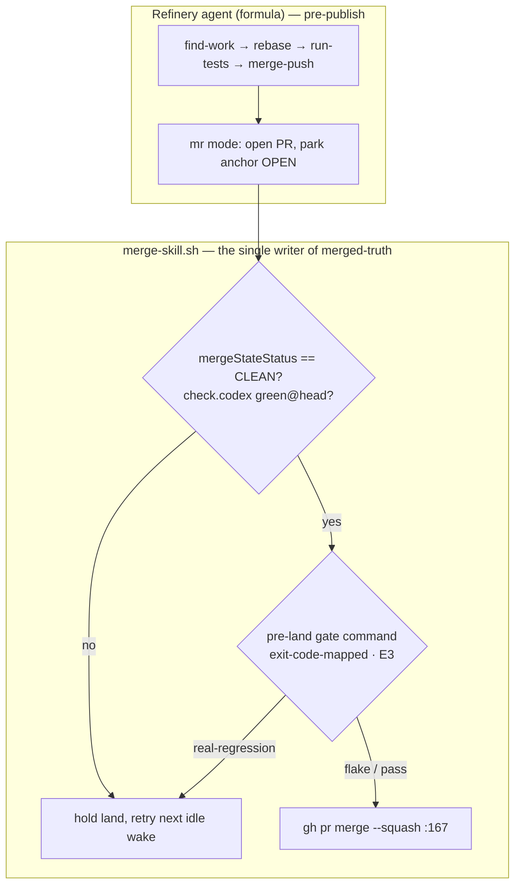
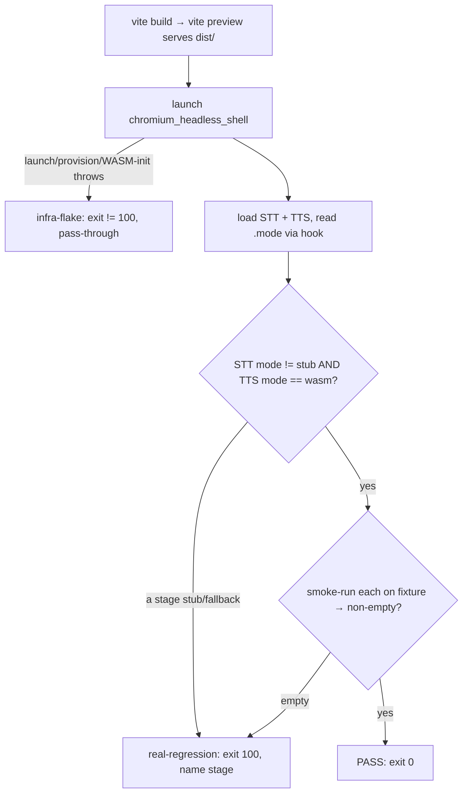

# feat: Rig-wide works-gate testing strategy (pure-WASM STT + TTS)

## Summary

Stand up the shutupandlisten rig's works-gate: a headless, host-runnable check
that loads the pure-WASM pipeline stages (STT, TTS), asserts each reports its
real backend (not a stub), and smoke-runs each once on a fixture. Ship the
**check** first — it is host-agnostic and independently runnable — then decide
its **enforcement** (how the refinery holds a land on a real-regression
verdict). The first validated unit fixes `su-lou.8`'s TTS stub and lands the
guard with it. The WebGPU stage (listener) and AudioWorklet stages (denoise,
VAD/smart-turn) are a named deferred tier, not in this slice.

The plan sequences three feasibility spikes first; the strategy's shape does
not depend on their answers, but they de-risk the build.

---

## Problem Frame

The operator is the integration test. At `1d36c86` the `web/` `node --test`
suite was green while the warmed loop degraded three of five stages to their
fallback in a real browser — denoise→passthrough, smart-turn→heuristic,
TTS→stub (`su-lou.8`). Unit tests drive stub/fallback *logic* on `FakeWorker`
seams (`web/src/stt.test.ts`, `web/src/tts.test.ts`); none load a real backend,
so nothing but the operator caught the degradation. `su-lou.7`/PR #20 (the
prior TTS stub) was likewise caught by review.

The gate host is a GPU-less, audio-less VM (verified, `su-lpdj.1`), so the
reachable surface is the two pure-WASM stages — STT and TTS. TTS is both
`su-lou.8`'s live bug and PR #20's stage: the highest-value assert is also the
one that runs headless here.

---

## Requirements Traceability

Requirements R1–R14 and AE1–AE4 are defined in the origin doc (see
`origin:`). This plan advances them as follows:

- **R1, R2, R3, R5, R6** (the check) → U6, grounded by U1/U5.
- **R4** (per-stage fixture smoke-run) → U6, feasibility in U1, fixture in U4.
- **R7–R10** (enforcement) → U8 (gc-toolkit generic pre-land gate) + U10 (rig
  wiring); mechanism resolved to E3-smart (see KTD5).
- **R11, R12** (standing strategy) → U9.
- **R13, R14** (first validated unit) → U7 (`su-lou.8` TTS fix + guard).
- **AE1–AE4** → U6 test scenarios (AE1 retargeted to TTS per reshaped origin).

---

## Key Technical Decisions

**KTD1 — The check runs against a `vite build` → `vite preview` build, not
`vite dev`.** Preview serves `dist/` and dev serves `public/` through different
roots (`web/src/asset-fallback.ts:125-128`); production-shape means preview.
The `provisionedAsset404()` guard applies in both, returning a real 404 for
missing provisioned assets (the su-lou.7 fix) so a missing asset surfaces as an
infra-flake, not a silent SPA-fallback.

**KTD2 — The assert reads each adapter's `.mode`, not device strings.** STT
`Transcriber.mode ∈ {moonshine, whisper, stub}` (`web/src/transcript.ts:15`,
set `web/src/stt.worker.ts:97-98`, validated `web/src/stt.ts:208`) — real =
`mode !== 'stub'`; the literal never contains `'wasm'`. TTS `Speaker.mode ∈
{webgpu, wasm, stub}` (`web/src/tts.ts:29`, set `web/src/tts.worker.ts:98-105`,
validated `:262-264`) — real = `mode === 'wasm'`, regression = `stub`. So R2's
"expected backend" is a per-stage literal set, declared explicitly (R3), not a
single `wasm` string.

**KTD3 — A guarded, preview-only mode hook is the read path.** Today mode is
DOM-text only (`web/src/main.ts:199-203`); no `window`/`globalThis` hook, and
workers only exist in a served bundle. Prefer a minimal hook (dev/preview-gated)
that publishes `{stt, tts}` modes once ready, so the check reads a stable API,
not scraped DOM. DOM-scrape is the fallback if the spike (U1) shows the hook
leaks into production paths.

**KTD4 — Exit-code taxonomy mirrors the rig's existing precedent.** Follow
`.github/workflows/promptfoo.yml:88-97`: `0` = pass; a distinct code (e.g.
`100`) = real-regression (a stage is stub/fallback, or a smoke-run produced
nothing) naming the stage; any other non-zero = infra-flake (provision, launch,
WASM-init, or timeout). This is what lets enforcement block on regression and
pass through on flake (R5, R8, R9).

**KTD5 — Enforcement is separated from the check and decided after it ships.**
There is **no per-rig pre-land command hook** at the refinery's merge point:
the land is `merge-skill.sh` (`gh pr merge --squash`, `:167`) gating only on
`check.<name>=green@head` markers + GitHub `mergeStateStatus == CLEAN` (`:158`).
Three enforcement options, traded against origin **R10** ("host, reuse
provisioned models, **zero GitHub-Actions minutes**"):

| Option | Mechanism | R10 | Change scope |
|---|---|---|---|
| **E1** | GitHub-hosted required check (`.github/workflows/`) | ✗ burns minutes + re-provisions ~700 MB in CI | rig-local |
| **E2** | Host-posted commit status / self-hosted runner on the rig host | ✓ reuses `web/public/models/`, zero hosted minutes | rig-local (standing host process) |
| **E3** | Pre-land command hook in `merge-skill.sh` (between `:158` CLEAN gate and `:167` merge) | ✓ | **shared-infra** — gc-toolkit pack every rig runs → operator sign-off |

**Decision (operator, 2026-07-18): E3, done minimally and generically.**
gc-toolkit is meant to support gates at various phases, so the land-phase gate is
a small, config-driven extension of the refinery — not a broad change. A rig
declares a pre-land gate command; the refinery runs it against the PR head
between the CLEAN gate (`:158`) and the squash-merge (`:167`), exit-code-mapped
per KTD4 (pass → proceed, real-regression → hold, flake → pass-through). Generic
across rigs, reusing the existing gate primitive (`check_set` / the publish-phase
test-command gate) rather than a parallel path; the works-check is its first
consumer. Design-first (U8) keeps the surface minimal. The check (Phase B) still
ships before any enforcement wiring — E3 only shapes U8/U10.

**KTD6 — Load-assert is necessary but NOT sufficient; the synthesis smoke-run is
mandatory (spike-proven, U1).** A mis-fixed TTS can load with `mode === 'wasm'`
yet still emit a placeholder tone (a typed-but-wrong `preprocessor_config.json`
makes the pipeline dispatch to an absent vocoder). Reading `.mode` alone would
pass a broken stage — so the works-check MUST smoke-run synthesis and assert
non-empty audio (R4), not merely read `.mode` (R2). The check also ships a
**raw-capture forensics mode** (a worker replaying stage init with errors
serialized, not swallowed) — it is what exposed the `su-lou.8` throw the shipped
`catch{}` hides.

---

## High-Level Technical Design

The refinery lands in two stages; the works-gate attaches at the second.

The check itself (U6):

---

## Implementation Units

### Phase A — Spikes (resolve shape; sequenced first)

### U1. Spike: headless reachability of the load-assert + smoke-run (and the `su-lou.8` repro)
- **Goal:** Prove go/no-go that STT and TTS load against a `vite preview`-served
  `dist/` in the cached `chromium_headless_shell`, report `.mode`, and can
  smoke-run on a fixture. The same harness is the headless repro that reveals
  `su-lou.8`'s `mms-tts-eng` "no model loaded" throw.
- **Requirements:** feasibility for R1, R2, R4; unblocks U5, U6, U7.
- **Dependencies:** none.
- **Files:** a throwaway spike script under `web/scripts/` (may seed the harness).
- **Approach:** `playwright-core` pointed at
  `~/.cache/ms-playwright/chromium_headless_shell-1228`; serve `dist/` via
  `vite preview`; drive `createTranscriber`/`createSpeaker` or read
  `sourceInfo` DOM; capture the TTS worker `reason`. Decide the mode-read
  mechanism (hook vs DOM-scrape vs adapter-import) → feeds KTD3/U5.
- **Execution note:** exploratory spike — output is a go/no-go decision, the
  chosen mode-read mechanism, and the captured `su-lou.8` throw, not shipped code.
- **Test scenarios:** none — spike.
- **Verification:** a written go/no-go with the captured worker `reason` for TTS.

### U2. Spike: smart-turn intended-floor decision
- **Goal:** Decide whether smart-turn's heuristic is the intended floor or should
  reach an on-device backend — resolves origin R3's expected-backend for that
  stage (it lives in the deferred AudioWorklet tier, so this does not gate the
  slice).
- **Requirements:** R3 (deferred-tier expected-backend).
- **Dependencies:** none.
- **Files:** read-only — `web/src/smart-turn.ts`, `su-lou.3` context; confirm no
  provisioner exists.
- **Test scenarios:** none — decision spike.
- **Verification:** a one-line expected-backend declaration for smart-turn,
  carried into the deferred tier (U9 / `su-lou.8` notes).

---

### Phase B — The works-check command (first slice; enforcement-agnostic)

### U3. Playwright wiring for the headless runner
- **Goal:** Add a headless-browser runner to `web/` that reuses the cached
  `chromium_headless_shell` without downloading a browser.
- **Requirements:** R1 (infra).
- **Dependencies:** U1.
- **Files:** `web/package.json` (devDep: `playwright-core`), works-check runner config.
- **Approach:** `playwright-core` with `executablePath` to the cached shell —
  avoid full `playwright` (three-browser download). `promptfoo/` already carries
  playwright 1.60.0 as precedent.
- **Patterns:** `promptfoo/package-lock.json` (playwright present); cached
  `chromium_headless_shell-1228`.
- **Test scenarios:** runner launches the cached shell and loads a served page
  (smoke). `Test expectation: minimal — infra unit.`
- **Verification:** the runner opens `vite preview` and returns page content headless.

### U4. Audio fixture for the STT smoke-run
- **Goal:** Add a small committed fixture WAV (short known utterance) for R4's
  STT smoke-run, with provenance.
- **Requirements:** R4.
- **Dependencies:** none.
- **Files:** `web/test/fixtures/utterance.wav` (+ a provenance note).
- **Approach:** a short (~1–2 s) clean **speech** clip decoded to PCM for the STT
  worker (a sine tone gives an empty transcript — U1). R4 is liveness — non-empty
  transcript, not accuracy. Option: bootstrap the fixture from the fixed TTS
  stage's own output (self-referential, no external asset).
- **Test scenarios:** none — fixture asset (consumed by U6).
- **Verification:** the file exists, is small, and STT returns a non-empty
  transcript on it in U1's harness.

### U5. Backend-mode read path — FOLDED into U6 (superseded by U1)
- U1 chose the **adapter-import probe page** as the works-check's mode-read (it
  imports the real adapters and reads `.mode` directly, exercising the production
  worker-bundle/engine-import/wasm paths), and the app already exposes modes via
  `#source-info` (`web/src/main.ts:199-203`) for the integration-level check. No
  dedicated app-side hook is needed. Bead `su-ljrb.5` closed as superseded.

### U6. The works-check command
- **Goal:** One repeatable command (`npm run works-check` →
  `web/scripts/works-check.mjs`) implementing R1–R6.
- **Requirements:** R1, R2, R3, R5, R6.
- **Dependencies:** U1, U3, U4.
- **Files:** `web/scripts/works-check.mjs`, a probe entry (`web/probe.html` +
  `web/src/probe.ts`), a spike-merged vite config (base `vite.config.ts`
  untouched), `web/package.json` (script).
- **Approach:** build → `vite preview` (serves `dist/`) → launch the cached
  headless shell (U3) → an **adapter-import probe page** (imports the real
  `createTranscriber`/`createSpeaker` + the app's resolvers) reads each `.mode`
  and **smoke-runs synthesis** → assert STT `!== 'stub'` and TTS `=== 'wasm'`
  (R2/R3) AND each smoke-run returns non-empty (R4, mandatory per KTD6) →
  classify + exit per KTD4. Ships a **raw-capture forensics mode** for failures.
  R6: runs standalone. Mode-read mechanism resolved by U1 (probe page over
  DOM-scrape / app hook; DOM-scrape kept as an integration-level check).
- **Technical design (directional):** exit `0` pass · `100` real-regression
  (stage stub/fallback or empty smoke) naming the stage · other non-zero
  infra-flake. Mirrors `promptfoo.yml:88-97`.
- **Test scenarios:**
  - `Covers AE3.` TTS reports `wasm`, STT reports `moonshine` → exit 0.
  - `Covers AE1.` TTS reports `stub` → exit 100, names TTS.
  - STT reports `stub` → exit 100, names STT.
  - `Covers AE4.` STT loads real but returns empty transcript on the fixture →
    exit 100 (liveness), names STT.
  - `Covers AE2.` headless launch or a WASM stage load throws/times out → infra
    -flake exit (not 100), land-agnostic surfacing.
- **Verification:** each scenario yields the specified exit code and stage name
  from a single `npm run works-check` invocation.

---

### Phase C — First validated unit

### U7. Fix `su-lou.8` TTS stub + land the works-check guard together
- **Goal:** Fix `su-lou.8`'s TTS stub — **root cause found (U1)** — and land it
  **with** U6's TTS synthesis-smoke asserting real audio (R14).
- **Requirements:** R13 (diagnose all three; fix TTS), R14 (fix+guard together,
  scoped to the reachable TTS stub).
- **Dependencies:** U1, U6. **Cross-epic:** the fix lands on the existing
  `su-lou.8` bead (P1, HELD, in the `su-lou` epic); the guard is this epic's U6.
  Coordinate a single landing.
- **Files:** `web/src/tts.worker.ts`, `web/src/tts.ts`, possibly
  `web/public/tts-engine.js` or `web/scripts/provision-tts.mjs`.
- **Approach:** ROOT CAUSE (U1): `mms-tts-eng` is VITS and its repo has **no**
  `preprocessor_config.json`; the transformers 3.8.1 `pipeline()` factory probes
  that optional file, and under `allowRemoteModels=false` the correct 404 (PR #20's
  contract) becomes a **fatal throw** that `tts.worker.ts`'s `catch{}` swallows →
  stub. (STT survives only because moonshine's repo *has* that file.) **Fabricating
  the file is NOT the fix** — a typed stub makes the pipeline load but dispatch to
  an absent vocoder (KTD6). **Validated fix (U1): component construction** — bypass
  the factory with `AutoModelForTextToWaveform.from_pretrained(model, {device:'wasm',
  dtype:'q8'})` + `AutoTokenizer` + a direct waveform call (loads AND synthesizes
  real speech headless). Implement in `web/public/tts-engine.js` /
  `web/src/tts.worker.ts`; confirm U6's synthesis smoke passes.
- **Execution note:** fix direction validated by U1 — no diagnosis needed;
  implement the component-construction path and guard it with U6's synthesis smoke.
- **Test scenarios:**
  - Post-fix, the TTS worker loads `mms-tts-eng` and reports `mode: wasm` (not
    `stub`) in the headless harness.
  - `Covers R14.` U6's TTS assert passes at the fixed SHA; a change re-introducing
    the stub trips the gate (exit 100).
- **Verification:** `npm run works-check` exits 0 for TTS at the fix SHA; the
  `su-lou.8` real-browser degradation for TTS no longer reproduces.

---

### Phase D — Enforcement (operator-gated)

### U8. gc-toolkit: minimal generic pre-land gate hook (design-first)
- **Goal:** Add a small, generic, config-driven pre-land gate to the refinery so
  a rig can have a command block a land on a real-regression verdict — the "smart
  E3." gc-toolkit is meant to support gates at various phases; this is the
  land-phase extension, kept minimal and reusable, not a broad change.
- **Requirements:** R7, R8, R9, R10.
- **Dependencies:** U6 (a command to gate on). **Shared-infra:** filed in the
  gc-toolkit store; bead → PR → Codex → refinery, like any gc-toolkit change.
- **Files:** `rigs/gc-toolkit/assets/scripts/merge-skill.sh` (attach between the
  CLEAN gate `:158` and the squash-merge `:167`); the rig config surface (a
  `formula_vars` key or a command-backed `check_set` entry); gc-toolkit docs.
- **Approach:** design-first — a short note fixing the mechanism before code:
  reuse the existing gate primitive (`check_set` / the publish-phase test-command
  gate) rather than a parallel path; a rig declares a pre-land command; merge-skill
  runs it against the PR head, exit-code-mapped per KTD4 (0 pass · regression code
  hold · other flake pass-through). Generic across rigs; minimal surface.
- **Execution note:** design note reviewed before implementation — this is
  shared infra every importer rig runs; keep the change small and generic.
- **Test scenarios:**
  - a rig with no gate command configured → land behaves exactly as today (no regression).
  - a configured command exiting 0 → land proceeds; regression code → land held;
    flake code → land proceeds, surfaced.
  - the gate runs against the PR head SHA, not a stale ref.
- **Verification:** with the works-check configured as the gate, a stub-SHA PR is
  held and a good-SHA PR lands; an unconfigured rig is unaffected.

### U10. shutupandlisten: wire the works-check as the gate's first consumer
- **Goal:** Configure shutupandlisten so the refinery runs the works-check (U6)
  as its pre-land gate, via U8's mechanism.
- **Requirements:** R7, R10.
- **Dependencies:** U6, U8.
- **Files:** the shutupandlisten rig block in `city.toml` (`formula_vars`) or the
  rig's check config — rig-local, no gc-toolkit change.
- **Approach:** point the pre-land gate command at `npm run works-check` (run on
  the host, reusing `web/public/models/`, zero GH minutes — honors R10).
- **Test scenarios:**
  - `Covers AE1.` a PR at a TTS-stub SHA → gate exits regression → land held.
  - `Covers AE2.` an infra-flake verdict → pass-through → land proceeds, surfaced.
- **Verification:** a throwaway PR at a known-stub SHA is held; at a known-good SHA it lands.

---

### Phase E — Standing strategy

### U9. The standing-strategy statement
- **Goal:** Record the principle (every operator-facing deliverable has an
  automated works-check for the stages a gate host can run) + the tiers
  (`node --test` logic / promptfoo quality / works-gate) + the works-gate's home
  and its deferred tier.
- **Requirements:** R11, R12.
- **Dependencies:** U6, U8 (records the enforcement home once chosen).
- **Files:** one rig doc — a short `docs/` strategy note (one doc per subject);
  add domain terms to `CONCEPTS.md` if missing.
- **Test scenarios:** none — doc.
- **Verification:** the doc names the three tiers, the works-gate home, and the
  deferred tier in brief points.

---

## Scope Boundaries

**Deferred tier (named, operator-side or GPU/audio-capable host):**
- WebGPU stage (listener) works-check — needs a real GPU the gate host lacks.
- AudioWorklet stages (denoise, VAD/smart-turn) works-check — need an audio device.
- Full-loop end-to-end liveness across all five stages — same operator-side tier.

**Deferred to follow-up work:**
- GitHub-Actions CI for heavy paths (the ~2.7 GB LLM) — Action-minute budget.
- Putting the `node --test` suite behind the same refinery gate — easy adjacent win.

**Outside this strategy's identity:**
- Output-quality judgment — promptfoo owns restraint / variety / probing-depth.
- The on-device / AS-native endgame beyond the browser floor — `su-lou`'s scope.

---

## Open Questions

- **Q1 — RESOLVED (operator, 2026-07-18): E3, minimal + generic.** The land-phase
  gate is a small config-driven extension of the refinery (U8), not a broad
  change; the works-check is its first consumer (U10). The check (Phase B) ships
  before any enforcement wiring. Remaining sub-question, deferred to U8's design
  note: reuse `check_set` vs a new `formula_vars` key for the command surface.
- **Q2 (planning, U2) — smart-turn intended floor** — heuristic-by-design or
  should reach an on-device backend? Sets R3's expected-backend for that stage.
- **Q3 (planning, U6) — signal taxonomy** — the exact WASM-load / smoke-run
  outcomes that map to real-regression vs infra-flake (KTD4 sets the frame).

---

## Risks & Dependencies

- **`su-lou.8` root cause is unknown until U1's headless repro.** U7's fix shape
  is diagnosis-gated (VITS-pipeline / opset / external-data are hypotheses). Risk:
  the fix is larger than a config change. Mitigation: U1 captures the actual throw
  before U7 commits; timebox.
- **The mode hook (U5) must not leak into production.** Mitigation: `PROD` guard
  + an explicit absent-in-prod test.
- **E3 touches shared infra (`merge-skill.sh`) every importer rig runs.**
  Mitigation: design-first note (U8), reuse the existing gate primitive, keep the
  surface minimal and generic; an unconfigured rig must behave exactly as today
  (a required no-op test scenario in U8); land via bead → PR → Codex like any
  gc-toolkit change.
- **Cross-epic coordination (U7 ↔ `su-lou.8`).** The fix bead lives in `su-lou`;
  the guard in this epic. Land together.
- **denoise passthrough may be a serving artifact, not a code bug (U1).** The
  spike saw real rnnoise headless under `vite preview`/`dist`, not the passthrough
  `su-lou.8` observed under `vite dev`. The `su-lou.8` denoise fixer (deferred
  tier) should compare dev-vs-preview serving of `/denoise/*` before assuming a
  code bug.

---

## Sources & Research

- `origin:` — the ratified requirements doc (R1–R14, AE1–AE4, reshape rationale).
- `su-lpdj.1` (closed) — the feasibility pass: GPU-less/audio-less VM; salvageable
  core = pure-WASM STT + TTS.
- Refinery land path: `rigs/gc-toolkit/assets/scripts/merge-skill.sh`
  (`:158` CLEAN gate, `:167` squash-merge), `rigs/gc-toolkit/formulas/
  mol-refinery-patrol.toml` (`:94` check_set, `:264` merge-skill invocation,
  `:366-468` run-tests/handle-failures), `rigs/gc-toolkit/assets/scripts/
  pre-open-resolve.sh:13` (codex-gate stamper). No per-rig pre-land command hook.
- Backend reporting: `web/src/transcript.ts:15`, `web/src/stt.ts:208`,
  `web/src/stt.worker.ts:97-98`; `web/src/tts.ts:29,262-264`,
  `web/src/tts.worker.ts:98-105`; DOM at `web/src/main.ts:199-203`.
- Build/serve: `web/src/asset-fallback.ts:34,125-128` (preview serves `dist/`,
  dev serves `public/`); `web/vite.config.ts` (`provisionedAsset404()`).
- Provision: `web/scripts/provision-stt.mjs`, `web/scripts/provision-tts.mjs`;
  committed wrappers `web/public/{stt,tts}-engine.js` (pin `device:wasm`,
  `dtype:q8`). Sizes: TTS 37 MB, STT ~663 MB, LLM ~2.7 GB.
- Precedent: `.github/workflows/promptfoo.yml:88-97` (exit-code flake/fail split);
  `web/src/stt.test.ts`, `web/src/tts.test.ts` (`FakeWorker` — the stub-only gap).
- `su-lou.7`/PR #20 — prior TTS stub (SPA-404 root cause; a *different* bug).
- `docs/findings/on-device-text-quality.md` — host discipline (no GPU/MLX;
  validate the harness, don't fabricate).
